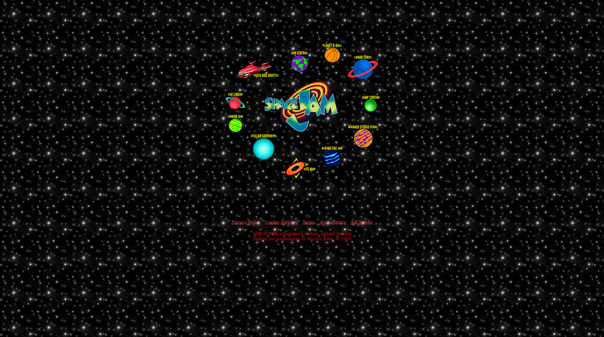
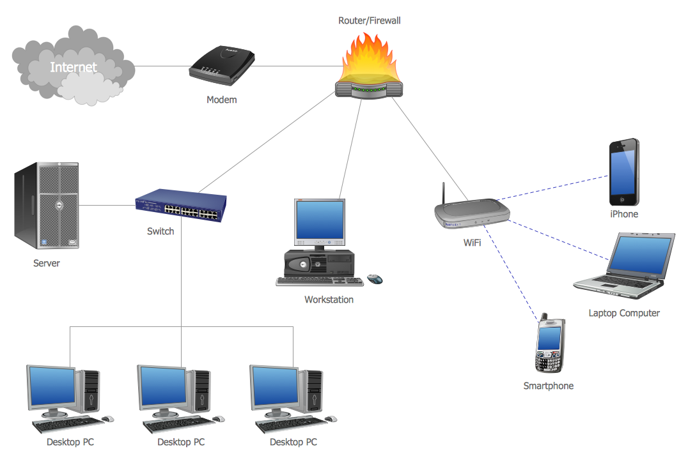
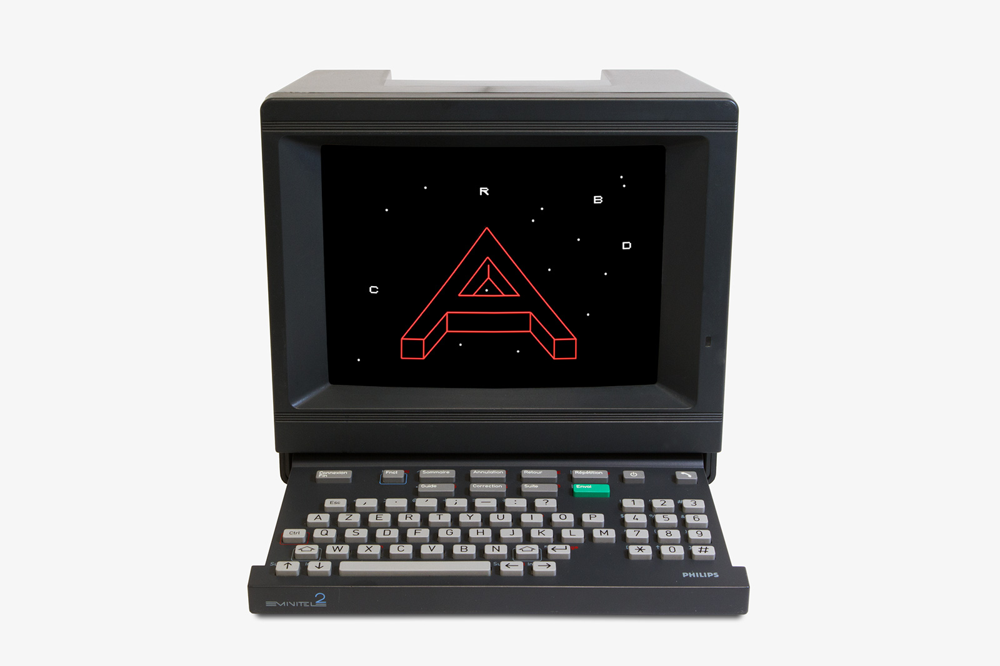
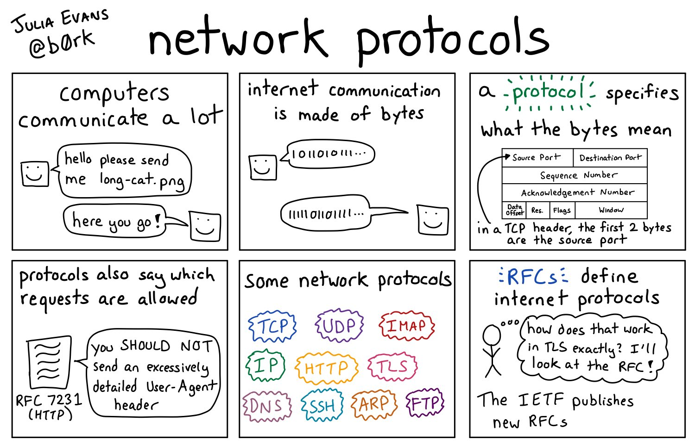
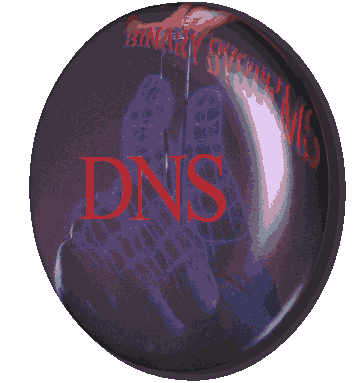
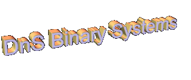
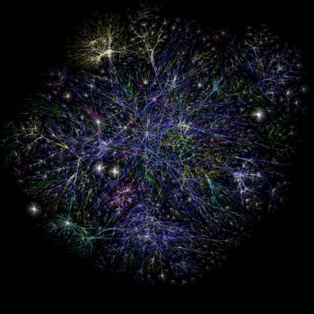
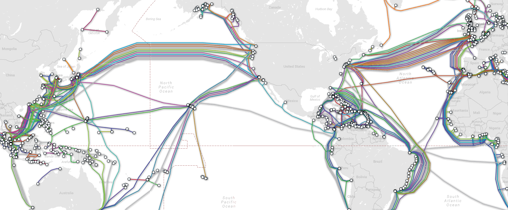
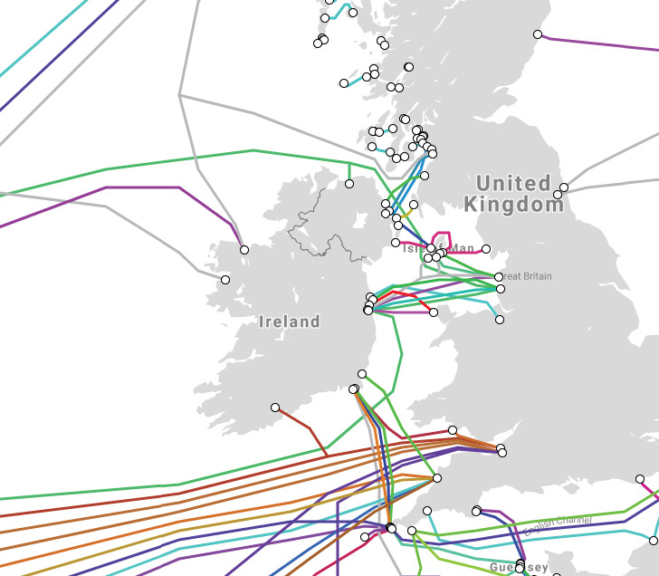

This page intentionally left blank. ⬇️, ➡️, or spacebar 🛰 to start slidedeck.
---
class: center, middle

# Welcome to Class 2!


---

# Agenda

- Assignment questions?
- News of the Week
- Imperfect metaphor of the week
- Readings
- Break!
- How the Internet Works!
  - Servers and DNS
	- URL and URIs
  - HTTP Status codes
  - TCP/IP
- Break!
- Wireshark demo (Hacking, monitoring, and what users do with these networks)
- Network Inspection (Chrome/Firefox tool)

---

## Assignment questions?

---

## News of the Week

Drop a link on the etherpad:
<https://etherpad.wikimedia.org/p/prattsi654fa20-2>

---
class: center, middle

#Imperfect metaphor of the week
---
background-image: url(https://ephemeralnewyork.files.wordpress.com/2009/06/crotonreservoir.jpg)

--
background-image: url(https://archive.li/bfmtJ/abc9fdf8bd33f02eafb6d907f90c4b140492ca2e.jpg)

---
background-image: url(https://web.archive.org/web/20050215063331im_/http://mindfully.org:80/Water/2004/NYC-Store-Water16may04f3.gif)
---
background-image: url(https://imgs.6sqft.com/wp-content/uploads/2016/03/10190245/nyc-water-supply-system1.jpg)

---

## Late breaking news
--
<blockquote class="twitter-tweet"><p lang="en" dir="ltr">imagining the last few days of a failing internet. the big server farms taken offline, huge swaths of AWS &amp; cloudflare dependencies failing. link rot spreading as hosts disconnect. eventually all you can access is some professor&#39;s hobby blog and the space jam website</p>&mdash; everest (@everestpipkin) <a href="https://twitter.com/everestpipkin/status/1301051972183822337?ref_src=twsrc%5Etfw">September 2, 2020</a></blockquote> <script async src="https://platform.twitter.com/widgets.js" charset="utf-8"></script>

---



https://spacejam.com/

---

class: middle, center

# Readings

--

Thoughts? Reactions? Suprises?

---
class: center, middle

# Networks

--

[Original [info + slides by Ashley Blewer](https://training.ashleyblewer.com/presentations/networks.html)]

---
# Networks

- protocols
- infrastructure
- the Internet

---

## But first

--

I want you to stare at the bottom left corner of your web browser, then hit refresh.
Do this a couple of times.

--

What do you see when you do this?

---
# Networks

A network is two or more devices that are connected together, and are able to communicate or share resources with each other. I like this picture because the firewall is on fire for some reason.

.center[]

---
## Never forget

... this all literally started as a sci-fi dream:

--

## **`"Galactic Network"`**


---

# What is the Internet?

> "Internet" refers to the global information system that -- (i) is logically linked together by a globally unique address space based on the Internet Protocol (IP) or its subsequent extensions/follow-ons; (ii) is able to support communications using the Transmission Control Protocol/Internet Protocol (TCP/IP) suite or its subsequent extensions/follow-ons, and/or other IP-compatible protocols; and (iii) provides, uses or makes accessible, either publicly or privately, high level services layered on the communications and related infrastructure described herein

---

## What's the difference between:
- "The Internet"
- "The World Wide Web"

?

---
# Protocols

This communication can happen because of established rules and standards around the sending of data.

--

## What are some examples of protocols you may have come across?

--

Shout 'em out!

---


Some common protocols for networking are:

- TCP/IP
- FTP (sending files)
- SMTP (email)
- HTTP
- Wi-Fi
- Bluetooth
- LTE

---
# Intermission: The early days

[telnet starwars](https://itsfoss.com/star-wars-linux/)


- `telnet towel.blinkenlights.nl` (try it, it works!)
- No terminal access? [here](https://www.youtube.com/watch?v=Dgwyo6JNTDA)'s a video (but it's not as fun!)

---
# telnet

- short for "teletype network"
- developed in 1969!
- a pre-WWW network communication

---
<!--


- [source: Rhizome Net Art Anthology: Reabracadabra](https://anthology.rhizome.org/reabracadabra)
- [wikipedia page on the Minitel](https://en.wikipedia.org/wiki/Minitel)

--- -->



- [source](https://twitter.com/b0rk/status/1222273122986024961)
---

# TCP/IP

**TCP**: Transmission Control Protocol  
**IP**: Internet Protocol


---
# TCP/IP
It is a set of rules that govern how data is transferred over the internet.  

TCP/IP was standardized via the [Internet Engineering Task Force](https://www.ietf.org/), and in fact the organization itself was established in order to properly identify and formalize TCP/IP as a standard.

---
# Introduction to TCP/IP

The 4-Layer Model (4m32s)

<iframe width="560" height="315" src="https://www.youtube.com/embed/KEWe-5Bk3Q0"
frameborder="0"
allow="accelerometer; autoplay; encrypted-media; gyroscope; picture-in-picture" allowfullscreen></iframe>

---
# The 4 layers

- Application layer (sends information to transport layer)
- Transport (TCP) layer (breaks packets down, ensures reliable byte stream)
- Internet (IP) layer (pair each packet to proper IP destination)
- Link layer (sends packets between IP and hosts)

---
# HTTP, FTP, SMTP

These are all internet protocols that work at the application level to help you access websites (HTTP), send files (FTP) and send email (SMTP) over the network.  

  

---
# HTTPS?

HTTPS is a protocol developed on top of HTTP that takes extra steps to ensure security, privacy, and integrity of the communication channel between you and the website.  


Why is this such a big deal?

---
# Activity: 🐠 Test your network 🦈

Use [WireShark](https://www.wireshark.org/) to understand your surroundings.

What is WireShark?  

> "Wireshark is the world’s foremost and widely-used network protocol analyzer. It lets you see what’s happening on your network at a microscopic level and is the de facto (and often de jure) standard across many commercial and non-profit enterprises, government agencies, and educational institutions." [source: website](https://www.wireshark.org/)

---
# Wireshark non-live demo

[HakTip - How to Capture Packets with Wireshark - Getting Started](https://www.youtube.com/watch?v=6X5TwvGXHP0)

<iframe width="560" height="315" src="https://www.youtube.com/embed/6X5TwvGXHP0" frameborder="0" allow="accelerometer; autoplay; encrypted-media; gyroscope; picture-in-picture" allowfullscreen></iframe>

---

# IP Addresses
## (The "IP" part of TCP/IP)

This is an IP Address:

<http://173.194.221.139>

--

Computers can understand it ...

humans not so much.

---

IPv4 (Internet Protocol version 4)  

32 bit  

4,294,967,296 possible addresses (2^32, or 256 \* 256 \* 256 \* 256)

Why is this a problem?

---
Enter IPv6

128-bit address

... or approximately 3.4×10^38 addresses

---
## So how do humans engage with this IP system effectively?


---
# Distributed Name Service (DNS)

What does this do?

.center[]

---
# Distributed Name Service (DNS)

- gives human-readable names to IP addresses
- lets people have simple email addresses
- gives us domain names (.com, .net, .club)

.center[]


---

## Uniform Resource Locators (URLs)

--

In meta-description:

#### `scheme://subdomain.domain.TopLevelDomain:port/path?query_string#fragment_id`

--
E.g.

<https://iiif.io/event/2020/iiifweek/#monday>

--

<https://www.theatlantic.com/magazine/archive/1945/07/as-we-may-think/303881/?single_page=true>


---

## What are some of the most common TLDs?

--

## What are other more exotic TLD options?


---

# HTTP Status codes

HTTP status codes are how our browsers know whether resources are where the URL says they should be.

--

They handle a variety of critical scenarios:
- Resources have changed addresses (think: automatic redirects)
- A user doesn't have permission to see a certain resources (think: pages that require login)
- A server is unable to deliver the resource, even though the address is accurate (think: someone's site is down entirely)

---

## HTTP status codes come in "series"
- 200 series
- 30x series
- 40x series
- 50x series

---

## OK 200

The request was fulfilled

--

> Note: you'll never actually "see" this code -- it means the request worked as expected!

---

## Redirection 3xx

E.g., 301 redirect means "Moved permanently"

http://si.pratt.edu

TO

https://www.pratt.edu/academics/information/


---

## Then there are the errors:
- USER ERRORS (400 series)
- SERVER ERRORS (500 series)

---

## Unauthorized 401
--

## Forbidden 403
--

## Not found 404

--


---

## 500 Internal Server Error

---

## https://httpstatusdogs.com/
## https://http.cat/

--


---


---


<https://twitter.com/DanaDanger/status/183316183494311936>


<pre>HTTP response codes for dummies.
50x: we screwed up.
40x: you screwed up.
30x: ask that dude over there.
20x: cool.</pre>


---
class: center, middle

# The Internet

"The best-known computer network"



[source](http://www.opte.org/maps/)

---
# The Internet

- [Quartz: Map of the Internet](https://qz.com/se/map-of-the-internet/)

- size and scope
- built up of things

---
# The internet is a real place

- Data centers
- Cables
- Towers
- Satellites
- in the air around us right now

---
# Short video

- [http://www.thepeoplescloud.org/](http://www.thepeoplescloud.org/) (introduction video, 2min)

---
# Submarine cables

Large networked systems are connected to each other via undersea cables.

.center[]

[source: submarinecablemap.com](https://www.submarinecablemap.com/)

---
# Access

Access to the internet is not a given



---
# Activity: ping

Running `ping [site]` in your shell will test your connection between you and the site you are trying to connect to. It should look something like:

Running `ping -c 5 google.com`:

```
PING google.com (172.217.10.46): 56 data bytes
64 bytes from 172.217.10.46: icmp_seq=0 ttl=54 time=14.954 ms
64 bytes from 172.217.10.46: icmp_seq=1 ttl=54 time=13.729 ms
64 bytes from 172.217.10.46: icmp_seq=2 ttl=54 time=20.970 ms
64 bytes from 172.217.10.46: icmp_seq=3 ttl=54 time=15.135 ms
64 bytes from 172.217.10.46: icmp_seq=4 ttl=54 time=16.923 ms

--- google.com ping statistics ---
5 packets transmitted, 5 packets received, 0.0% packet loss
round-trip min/avg/max/stddev = 13.729/16.342/20.970/2.529 ms
```

---
# Activity: trace

Maybe you want to know more than you can connect to google and not lose any data along the way. Maybe you want to know how those pings got there, and where "there" is. For this you can use trace!

On Mac/Linux, it's `traceroute` and on Windows it is `tracert`

The first hop will probably be from your computer to your router. After that, it's out on the internet. Hopping somewhere close like from NYC to google.com or loc.gov might take something like 8 hops. Hopping from NYC to Cambodia might take 16 or so hops.

Some sites end up returning `* * *` between hops or near the end. What is that? It means your packets are not sending back a response and have timed out, waiting for it. They could be getting ignored or not being received, or they are bouncing around inside a firewall and you cannot directly reach your specified server.

---
# Is this a lot?

.center[]

Almost done!

---
# People make networks

Not everything has to be super technical, there is a very large and chaotic "people" layer when it comes to computer networks.

.center[]

---

# Network Inspection (Chrome/Firefox tool)

Press option+command+I (on a Mac or PC, in Chrome or in Firefox)

---
# Moment of zen 1

[Simon Weckert: Google Maps Hacks (2020)](http://www.simonweckert.com/googlemapshacks.html)

<iframe width="560" height="315" src="https://www.youtube.com/embed/k5eL_al_m7Q" frameborder="0" allow="accelerometer; autoplay; encrypted-media; gyroscope; picture-in-picture" allowfullscreen></iframe>

---
# Moment of zen 2

- [Rhizome write-up](https://anthology.rhizome.org/everythingiveeverwantedtoknow-com)
- [everythingiveeverwantedtoknow.com](http://everythingiveeverwantedtoknow.com/)

.center[]

---
# Additional Resources

- [Do Not Track: A Personalized Documentary](https://donottrack-doc.com/en/intro/)
- [Evolution of the Web](http://www.evolutionoftheweb.com/?hl=en)
- [Quartz: Map of the Internet](https://qz.com/se/map-of-the-internet/)
- [Ingrid Burrington: Networks of New York](http://lifewinning.com/projects/networks-of-new-york/)
- [Julia Evan: Networking zine](https://jvns.ca/networking-zine.pdf)
- [The People's Cloud](http://www.thepeoplescloud.org/)
- [Miriam Posner: Systems & Infrastructures Syllabus](http://miriamposner.com/classes/is270w18/)
- [Radia Perlman - "Computer Networks: Myths, Missteps, and Mysteries" (TCSDLS 2018-2019)](https://www.youtube.com/watch?v=qXz_RxBFQ20)
- [Vox: How Does the Internet Work? - Glad You Asked S1](https://www.youtube.com/watch?v=TNQsmPf24go)

---
# Learning more  

- [Computers](https://training.ashleyblewer.com/presentations/computers.html)  
- [Fixity](https://training.ashleyblewer.com/presentations/fixity.html)
- [Storage](https://training.ashleyblewer.com/storage.html)  
- [SSH](https://training.ashleyblewer.com/ssh.html)
- [World Wide Web](https://training.ashleyblewer.com/world-wide-web.html)
